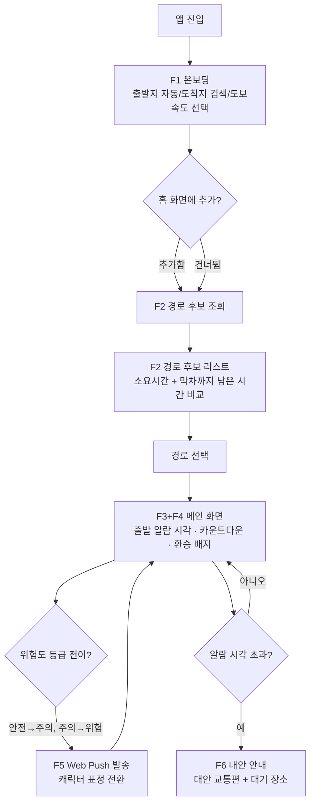
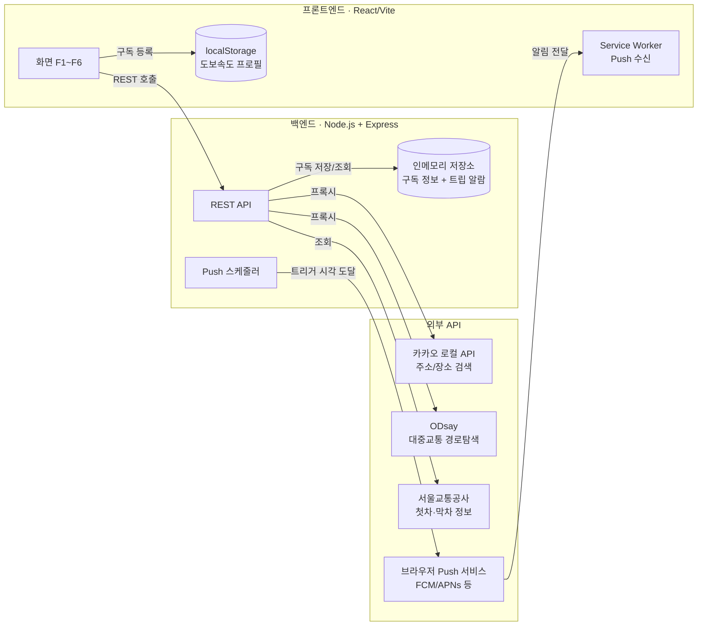

# Newbiton PRD — 환승 막차 알리미 (가칭)

> 작성일: 2026-09-12 (뉴비톤 해커톤 당일) · 상태: 작성 중 (팀 개발 기준 문서)

## 0. 팀 & 기본 정보

| 구분 | 내용 |
|---|---|
| 팀 구성 | 프론트엔드 1명 / 백엔드 1명(본인) / 총괄·보고서(기획+발표자료+진행관리) 1명 |
| 저장소 | GitHub `Newbiton` (프론트엔드는 이 저장소를 클론해 작업) |
| 일정 | 오늘 10:00 시작 → 21:00 개발 완료 → 21:00~22:00 발표자료/데모 준비 → 22:00 종료 |
| 오늘의 성공 기준 | 실제 URL로 배포까지 완료 (심사위원이 직접 접속해 사용 가능한 상태) |

## 1. 개요

### 1.1 문제 정의
대중교통 이용자는 막차 시간을 확인하더라도, 환승이 필요한 경로에서는 환승에 실제로 걸리는 이동 시간을 고려하지 못해 막차를 놓치는 경우가 많다. 또한 기존 막차 안내 서비스는 모든 사용자에게 동일한 소요시간을 적용하기 때문에, 걸음이 느리거나 빠른 사용자에게는 안내 시각이 부정확하다.

### 1.2 해결 방안
서울시 지하철 실시간/막차 데이터와 환승역 소요시간 데이터를 결합하여, 환승을 포함한 경로 기준으로 "지금 출발해야 막차를 탈 수 있는 시각"을 계산해 안내한다. 여기에 사용자가 직접 측정한 도보속도 프로필을 반영해 개인별로 보정된 소요시간을 제공한다.

### 1.3 핵심 가치
- 환승역에서 실제 이동 시간을 반영해 "이론상 막차"가 아닌 "실제로 탈 수 있는 막차"를 안내
- 사용자별 도보속도를 반영한 개인화된 여유시간 계산
- 하나의 화면에서 막차까지 남은 시간을 직관적으로 확인

### 1.4 MVP 범위 (기획자 서비스 흐름 반영, v3)
1. **출발지·도착지 설정 및 도보속도 선택** — 도착지는 역·정류장뿐 아니라 임의 주소까지 검색 허용. 도보속도는 상/중/하 3단계 수동 선택(기본)이며, "정확히 측정하기" 선택적 버튼으로 실측 옵션 제공(시간이 남으면 구현)
2. **경로 후보 탐색 및 선택** — 지하철·버스를 포함한 경로 후보를 여러 개 제시하고, 각 후보의 총 소요시간과 그 경로 기준 막차까지 남은 시간을 함께 보여줘 사용자가 비교해 선택
3. **선택 경로 기준 역산 출발 알람 시각 제시** — 선택한 경로상 모든 대중교통의 막차/막버스 시각을 고려해 "몇 시까지 출발해야 하는지" 계산
4. **환승구간별 여유시간 표시** — 안전(5분 이상)/주의(2~5분)/위험(2분 미만) 3등급 색상 배지
5. **막차 임박 Web Push 알림 + 캐릭터 표정 변화** — 실제 브라우저 Push 알림(탭이 닫혀 있어도 수신), 위험도 3단계에 맞춰 캐릭터 표정이 앱 아이콘·알림 이미지에서 점진적으로 변화 (표정 이미지는 팀이 직접 제작하며, 프론트엔드 개발 마지막 단계에 적용)
6. **막차 실패(알람 초과) 시 대안 안내** — 대안 교통수단과 인근 대기 장소 안내 (비용 비교는 제외)

### 1.5 향후 확장 (Future Work, 이번 MVP 범위 제외)
- 알람 실패 시 대안별 비용 비교 (택시 요금 추정 등)
- 현재 위치 기반 최적 역·정류장 추천 (GPS로 가장 유리한 탑승 지점을 자동 추천)

### 1.6 제약사항 및 가정
- 경로탐색은 [ODsay 대중교통 길찾기 API](https://lab.odsay.com/guide/guide)를 사용해 지하철+버스 통합 경로를 받아오고, 여기에 막차/환승/도보속도 로직을 얹는 방식으로 구현 (자체 경로탐색 알고리즘은 개발하지 않음)
- ODsay는 즉시 자동승인이 아니라 별도 회원가입·앱 등록이 필요 — 오늘 가장 먼저 처리해야 할 항목
- 도보속도 프로필은 브라우저 localStorage에 저장되어 기기·브라우저별로 독립적으로 관리됨 (다른 기기에서는 프로필이 유지되지 않음)
- **iOS 제약**: Web Push를 수신하려면 iOS 16.4 이상 + 홈 화면에 추가된 PWA 상태여야 함 (일반 Safari 탭에서는 권한 자체가 뜨지 않음). 따라서 온보딩에 "홈 화면에 추가" 유도 UI가 최소 기능으로 포함되어야 함
- 도착지는 역·정류장명뿐 아니라 임의 주소까지 검색 가능해야 함 — 지오코딩(주소→좌표 변환) API가 별도로 필요하며 5장에서 확정 (ODsay 자체 주소 변환 기능 우선 확인, 부족하면 카카오/네이버 로컬 검색 API 추가 검토)
- 도보속도는 기본적으로 상/중/하 수동 선택이며, GPS 기반 실측 측정은 선택적 스트레치 기능(온보딩에 "정확히 측정하기" 버튼만 우선 배치, 시간이 남을 때 실제 측정 로직 구현)
- 캐릭터 표정 이미지 3종(안전/주의/위험)은 팀이 자체 제작해 전달, 프론트엔드는 최종 단계에서 적용

---

## 2. 핵심 기능 명세

| ID | 기능명 | 우선순위 |
|---|---|---|
| F1 | 출발지·도착지 설정 및 도보속도 선택 | 필수 (1단계) |
| F2 | 경로 후보 탐색 및 선택 | 필수 (1단계, F1 직후) |
| F3 | 선택 경로 기준 역산 출발 알람 시각 | 필수 (2단계) |
| F4 | 환승구간별 여유시간 등급 표시 | 필수 (2단계, F3와 함께) |
| F5 | 막차 임박 Web Push + 캐릭터 표정 변화 | 필수 (3단계, 표정 적용은 마지막) |
| F6 | 막차 실패 시 대안 안내 | 필수 (4단계) |

### F1. 출발지·도착지 설정 및 도보속도 선택

- **목적**: 경로탐색에 필요한 최소 입력을 받고, 이후 모든 소요시간 계산의 기준이 될 개인 도보속도를 확정한다.
- **입력**
  - 출발지: GPS 기반 현재 위치 자동 수집 (권한 거부 시 텍스트 검색으로 대체)
  - 도착지: 텍스트 검색 — 역·정류장명뿐 아니라 임의 주소·장소명까지 허용, 후보 목록에서 선택
  - 도보속도: 상/중/하 중 1개 선택 (기본값: 중). 옆에 "정확히 측정하기" 선택적 버튼 배치 — 누르면 GPS 기반 실측 플로우로 진입 (스트레치 기능, 시간이 남을 때 구현)
- **처리 로직**
  - 도착지 검색어를 좌표로 변환 (지오코딩 API 필요, 5장에서 확정)
  - 선택한 도보속도 등급을 보정계수로 매핑 (예: 상 0.85x, 중 1.0x, 하 1.2x — 실제 계수는 개발 중 튜닝)
- **출력/화면**: 온보딩 화면 1개 (위치 권한 요청 → 도착지 검색 → 도보속도 선택 + 실측 옵션 → "홈 화면에 추가" 유도, 한 화면 또는 순차 플로우로 구성)
- **저장**: 도보속도 선택값은 브라우저 localStorage에 저장해 다음 방문 시 재사용 (변경 가능)
- **예외 처리**: 위치 권한 거부 시 출발지 텍스트 검색 폴백 제공, 검색 결과 없음 시 안내 메시지

### F2. 경로 후보 탐색 및 선택

- **목적**: 하나의 경로만 일방적으로 계산해 보여주지 않고, 여러 이동 방법 중 사용자가 직접 비교해 고를 수 있게 한다.
- **입력**: F1에서 확정된 출발지/도착지 좌표
- **처리 로직**
  1. 백엔드가 ODsay API를 프록시 호출해 출발지→도착지 대중교통 경로 후보 여러 개(지하철/버스 조합별)를 수신
  2. 각 후보에 대해 총 소요시간과, 그 경로 기준 막차·막버스까지 남은 시간을 함께 계산해 목록으로 정렬(예: 막차 여유시간이 넉넉한 순)
- **출력/화면**: 경로 선택 화면 — 후보별 카드에 "총 소요 OO분 · 막차까지 OO분 남음"을 나란히 표시, 탭하면 F3 메인 화면으로 이동
- **사용 데이터/API**: ODsay 대중교통 길찾기 API (다중 경로 옵션 파라미터 확인 필요, 5장에서 확정)
- **예외 처리**: 후보가 1개뿐이거나 없을 경우 안내 문구 처리 (없으면 F6 대안 안내로 유도)

### F3. 선택 경로 기준 역산 출발 알람 시각

- **목적**: 사용자가 고른 경로를 기준으로, 막차를 놓치지 않으려면 몇 시까지 출발해야 하는지 계산해 보여준다.
- **입력**: F2에서 선택된 경로, F1의 도보속도 보정계수
- **처리 로직**
  1. 선택 경로에 포함된 각 노선(지하철 호선/버스 노선)의 막차·막버스 시각 데이터를 조회
  2. 경로의 마지막 구간부터 역산하여, "이 경로대로 지금 출발하면 마지막 막차/막버스를 탈 수 있는 가장 늦은 출발 시각"을 계산 (도보 구간은 F1의 보정계수 적용)
  3. 현재 시각과 비교해 카운트다운 형태로 표시
- **출력/화면**: 메인 화면 — 출발 알람 시각(예: "18:47까지 출발하세요"), 남은 시간 카운트다운, 경로 요약(환승 횟수·전체 소요시간)
- **사용 데이터/API**: 서울교통공사 첫차·막차 정보, 서울시 막차시간표 검색, (버스) 국토교통부/서울시 버스 관련 막차 데이터 — 5장에서 확정
- **예외 처리**: 경로상 막차가 이미 종료된 노선이 있을 경우 F6(대안 안내)로 분기, ODsay 응답 실패 시 재시도 또는 에러 안내

### F4. 환승구간별 여유시간 등급 표시

- **목적**: 환승이 여러 번 있는 경로에서 어느 구간이 가장 빠듯한지 한눈에 보여준다.
- **입력**: F3에서 계산된 각 환승 구간별 여유시간(다음 열차/버스 출발까지 남는 시간 − 환승 이동 소요시간)
- **처리 로직**: 구간별 여유시간을 5분 이상(안전) / 2~5분(주의) / 2분 미만(위험) 3등급으로 분류
- **출력/화면**: F3 메인 화면 내 경로 요약에 환승 구간마다 색상 배지(초록/노랑/빨강)로 표시
- **예외 처리**: 환승이 없는 단일 노선 경로는 이 표시를 생략

### F5. 막차 임박 Web Push 알림 + 캐릭터 표정 변화

- **목적**: 사용자가 앱을 보고 있지 않아도 막차 임박 상황을 놓치지 않도록 알리고, 감정적으로 몰입되는 캐릭터 연출로 긴박함을 전달한다.
- **입력**: F4의 위험도 등급 전이 시점 (안전→주의, 주의→위험)
- **처리 로직**
  - 프론트엔드에서 Push 구독을 생성해 백엔드에 저장
  - 백엔드가 F3에서 계산된 시각을 기준으로 위험도 등급이 바뀌는 시점마다 Web Push 메시지 발송 (VAPID 기반, web-push 라이브러리 사용)
  - 알림에 포함되는 이미지/앱 아이콘을 위험도 등급(3단계)에 맞는 캐릭터 표정으로 전환
- **출력/화면**: OS 알림 센터에 표시되는 Push 알림, 알림 클릭 시 앱으로 복귀
- **의존성/제약**: iOS는 16.4 이상 + 홈 화면 추가 PWA 상태에서만 수신 가능 (F1 온보딩에서 "홈 화면에 추가" 유도를 바로 노출). 캐릭터 표정 이미지 3종은 팀이 직접 제작해 프론트엔드에 전달
- **개발 순서**: 백엔드 Push 발송 로직과 기본 알림(텍스트)은 초기 단계에 구현하고, 캐릭터 표정 이미지 적용은 프론트엔드 개발 마지막 단계에서 진행
- **예외 처리**: Push 권한 거부 시 앱 내 배너로 대체 안내

### F6. 막차 실패(알람 초과) 시 대안 안내

- **목적**: 사용자가 알람 시각을 넘겨 더 이상 선택 경로로 막차를 탈 수 없을 때, 당황하지 않도록 대안을 즉시 제시한다.
- **입력**: F3 기준 출발 알람 시각을 초과한 시점의 사용자 현재 위치
- **처리 로직**: 현재 위치 기준으로 이용 가능한 대안 교통수단(심야버스, 택시 승차 지점 등) 후보를 조회하고, 근처 대기 장소(편의점, 24시간 시설 등) 정보를 함께 제시
- **출력/화면**: 대안 안내 화면 — 대안 교통수단 리스트 + 대기 장소 안내 (비용 비교 수치는 이번 범위에서 제외, "Future Work"로 문구만 노출)
- **사용 데이터/API**: 5장에서 확정 (심야버스 노선 데이터, 대기 장소용 POI 데이터 등 추가 조사 필요)
- **예외 처리**: 대안 교통수단도 없는 완전 심야 시간대(예: 새벽 2~4시)에는 "다음 첫차 시각" 안내로 대체

## 3. 사용자 플로우



1. 사용자가 앱을 열면 F1 온보딩에서 출발지(자동)·도착지(검색)·도보속도를 설정하고, iOS라면 "홈 화면에 추가" 배너를 본다.
2. 설정이 끝나면 F2에서 경로 후보를 받아 비교하고 하나를 선택한다.
3. 선택 즉시 F3+F4 메인 화면으로 이동해 출발 알람 시각, 카운트다운, 환승구간 여유시간 배지를 확인한다.
4. 앱을 보고 있지 않아도 위험도 등급이 바뀔 때마다 F5 Push 알림과 캐릭터 표정 변화로 안내받는다.
5. 알람 시각을 넘기면 자동으로 F6 대안 안내로 전환되어 대안 교통편과 대기 장소를 확인한다.

## 4. 시스템 아키텍처



- **원칙**: 모든 외부 공공데이터·ODsay·지오코딩 API 호출은 백엔드가 프록시한다. 서비스키는 백엔드 환경변수로만 보관하고 프론트엔드에는 절대 노출하지 않는다.
- **프론트엔드(React/Vite)**: 화면 렌더링, 도보속도 프로필의 localStorage 관리, Service Worker 등록 및 Push 구독 생성.
- **백엔드(Node.js/Express)**: REST API 제공, 외부 API 프록시·가공(경로 후보에 막차 정보 결합, 역산 알람 시각 계산, 위험도 등급 산출), Push 구독 저장, 등급 전이 시점마다 Push 발송을 트리거하는 스케줄러(setInterval 또는 경량 작업 큐로 구현).
- **저장소**: 앱 전용 DB는 두지 않는다. Push 구독 및 진행 중인 트립의 알람 상태는 백엔드 프로세스의 인메모리 저장소(Map/객체)에 보관한다. 서버가 재시작되면 진행 중인 구독 정보가 초기화되는 점을 감수하고, 오늘 하루 데모 목적에 한해 허용한다(10장 리스크에 명시).

## 5. API 명세

> 베이스 URL은 배포 시 확정. 아래는 프론트엔드가 바로 개발을 시작할 수 있도록 정한 계약(contract)이며, 백엔드 구현 중 세부 필드명은 조정될 수 있다(변경 시 이 표를 갱신).

| 메서드 | 엔드포인트 | 설명 | 대응 기능 |
|---|---|---|---|
| GET | `/api/geocode?query=` | 검색어(역명/장소/주소)를 좌표 후보 목록으로 변환. 카카오 로컬 API 프록시 | F1 |
| GET | `/api/routes?startX=&startY=&endX=&endY=&walkSpeed=` | 경로 후보 목록 반환 (아래 스키마) | F2, F3, F4 |
| POST | `/api/push/subscribe` | Push 구독 정보 + 선택된 트립의 알람 정보 저장 | F5 |
| DELETE | `/api/push/subscribe/:id` | 트립 종료/알람 취소 시 구독 해제 | F5 |
| GET | `/api/alternatives?lat=&lng=&time=` | 대안 교통수단 + 대기 장소 목록 | F6 |

### `GET /api/routes` 응답 스키마 (예시)
```json
{
  "candidates": [
    {
      "routeId": "r1",
      "legs": [
        { "mode": "subway", "line": "2호선", "from": "강남", "to": "잠실", "durationMin": 12 },
        { "mode": "transfer", "durationMin": 4, "walkAdjustedMin": 4.8 },
        { "mode": "bus", "line": "지선버스 461", "from": "잠실역", "to": "목적지 인근", "durationMin": 15 }
      ],
      "totalDurationMin": 34,
      "transferGaps": [
        { "afterLeg": 0, "minutesLeft": 6, "safety": "safe" }
      ],
      "departureDeadline": "2026-09-12T18:47:00+09:00",
      "minutesUntilDeadline": 23
    }
  ]
}
```
- `walkAdjustedMin`은 F1의 도보속도 보정계수를 적용한 값.
- `transferGaps[].safety`는 F4 기준(5분↑ safe / 2~5분 caution / 2분미만 danger)으로 백엔드가 계산해 내려준다 — 프론트는 색상만 매핑.
- 후보가 여러 개면 `candidates` 배열에 여러 항목이 담기며, F2 화면은 이 배열을 그대로 카드 리스트로 렌더링한다.

### `POST /api/push/subscribe` 요청 예시
```json
{
  "subscription": { "endpoint": "...", "keys": { "p256dh": "...", "auth": "..." } },
  "selectedRoute": { "departureDeadline": "2026-09-12T18:47:00+09:00", "transferGaps": [ ... ] }
}
```

### `GET /api/alternatives` 응답 스키마 (예시)
```json
{
  "transitAlternatives": [
    { "type": "night_bus", "name": "심야버스 N26", "walkMin": 4, "intervalMin": 20 }
  ],
  "waitingSpots": [
    { "name": "24시간 편의점", "walkMin": 1 }
  ],
  "costComparison": null
}
```
- `costComparison`은 Future Work 자리로 항상 `null` 반환 (프론트는 이 필드가 null이면 "비용 비교 예정" 배지를 표시).

## 6. 데이터 모델

### 6.1 프론트엔드 — localStorage
```json
{
  "walkSpeedLevel": "중",
  "walkSpeedMeasuredSecPer100m": null,
  "homeScreenPromptDismissed": false
}
```

### 6.2 백엔드 — 인메모리 (프로세스 재시작 시 초기화됨)
```
PushSubscription {
  id: string
  endpoint, keys
  departureDeadline: datetime
  transferGaps: [...]
  lastNotifiedSafety: "safe" | "caution" | "danger" | null
}
```
백엔드 스케줄러는 주기적으로(예: 10초 간격) 저장된 트립들을 순회하며 현재 시각 기준 위험도 등급을 재계산하고, `lastNotifiedSafety`와 달라졌을 때만 Push를 발송한다.

## 7. 개발 프로세스

원칙: **한 단계가 끝날 때마다 반드시 테스트·검증하고, 결과를 요약 보고한 뒤 "다음 단계 진행" 지시가 있어야 다음 단계로 넘어간다.**

| 단계 | 내용 | 담당 | 완료 기준(테스트) |
|---|---|---|---|
| 0 | 저장소/환경 세팅 — 백엔드 Express 스캐폴드, 프론트 Vite 스캐폴드, ODsay·공공데이터포털·카카오 로컬 API 키 발급 | 백엔드+프론트 | 양쪽 로컬 서버 정상 기동, 키 발급 완료 확인 |
| 1 | F1 온보딩 — 프론트 UI + `/api/geocode` 연동 | 프론트/백엔드 | 임의 주소 검색 시 좌표 정상 반환, 도보속도 선택값 localStorage 저장 확인 |
| 2 | F2 경로 후보 — `/api/routes` 구현(ODsay 프록시+막차 결합) + 프론트 리스트 화면 | 백엔드 우선, 프론트 병행 | 실제 구간으로 호출해 후보 2개 이상, 막차 남은시간 값이 합리적인지 확인 |
| 3 | F3+F4 메인 화면 — 역산 알람 시각, 카운트다운, 환승 배지 | 프론트 | 시각이 실제 시계와 맞게 카운트다운되는지, 배지 색상이 임계값대로 바뀌는지 확인 |
| 4 | F5 Push — 백엔드 스케줄러 + 프론트 Service Worker/구독 (텍스트 알림까지, 캐릭터 이미지 제외) | 백엔드+프론트 | 실기기(안드로이드/아이폰 PWA)에서 등급 전이 시 알림 실제 수신 확인 |
| 5 | F6 대안 안내 | 백엔드+프론트 | 알람 시각을 인위적으로 지나게 만들어 대안 화면 전환 확인 |
| 6 | 폴리싱 — 캐릭터 표정 이미지 F5에 적용(프론트 마지막), 전체 화면 스타일 다듬기 | 프론트 | 3단계 표정이 실제 알림/아이콘에 반영되는지 확인 |
| 7 | 배포 | 백엔드+프론트 | 배포된 URL에서 전체 플로우(F1→F6) 재현 확인 |

## 8. 일정

| 시간 | 단계 |
|---|---|
| 10:00 – 10:30 | 단계 0: 환경 세팅, API 키 발급 |
| 10:30 – 12:00 | 단계 1: F1 온보딩 |
| 12:00 – 14:00 | 단계 2: F2 경로 후보 |
| 14:00 – 16:00 | 단계 3: F3+F4 메인 화면 |
| 16:00 – 18:30 | 단계 4: F5 Push (텍스트 알림까지) |
| 18:30 – 19:30 | 단계 5: F6 대안 안내 |
| 19:30 – 20:30 | 단계 6: 폴리싱(캐릭터 표정 적용 등) |
| 20:30 – 21:00 | 단계 7: 배포 및 전체 플로우 리허설 |
| 21:00 – 22:00 | 발표자료/데모 준비 (총괄 담당) |

각 시간대는 목표치이며, 매 단계 종료 시 실제 소요와 이슈를 다음 단계 시작 전에 팀에 공유한다.

## 9. 배포 계획

- **프론트엔드**: Vercel — React/Vite 프로젝트를 GitHub 저장소와 연결해 자동 배포
- **백엔드**: Render — Node/Express 서버 배포 (무료 플랜, 슬립 모드 유의 — 데모 직전 미리 한 번 호출해 깨워둘 것)
- **환경변수**: ODsay 앱키, 공공데이터포털 서비스키, 카카오 로컬 API 키, VAPID 키(Push)는 모두 백엔드 배포 환경변수로 등록. 프론트엔드에는 백엔드 API 베이스 URL만 환경변수로 전달
- **CORS**: 백엔드는 배포된 프론트엔드 도메인만 허용하도록 설정

## 10. 제약사항 및 리스크

- 경로탐색은 ODsay API에 의존 — 오늘 회원가입·앱 등록이 지연되면 F2 전체가 막히므로 단계 0에서 최우선 처리
- 인메모리 저장소를 사용하므로 백엔드 서버가 재배포/재시작되면 진행 중인 Push 구독이 모두 초기화됨 — 데모 직전에는 서버 재시작을 피할 것
- iOS Push는 16.4 이상 + 홈 화면 추가 PWA 상태에서만 동작 — 데모 리허설 시 반드시 실제 아이폰으로 "홈 화면에 추가" 후 테스트할 것 (시뮬레이터/일반 사파리 탭에서는 재현되지 않음)
- 무료 API(ODsay Basic, 카카오 로컬, 공공데이터포털)의 일일 호출 한도를 사전에 확인하지 못함 — 개발 중 호출 수를 아껴 쓰고, 한도 초과 에러 처리(재시도/캐시)를 최소한으로 넣을 것
- 도보속도 프로필은 브라우저 localStorage 기반이라 기기·브라우저별로 독립적 — 다른 기기에서는 재설정 필요
- 캐릭터 표정 이미지 3종은 팀이 별도 제작 — 완성이 늦어지면 텍스트 알림만으로도 F5는 기능적으로 완결되도록 개발 순서를 잡음(7장 참고)
- 대안 안내(F6)에 필요한 심야버스 노선·대기 장소 데이터 소스는 아직 미확정 — 단계 5 착수 전 조사 필요
- 비용 비교(F6 확장) 및 현재위치 기반 최적역 추천은 이번 MVP에서 의도적으로 제외 (1.5 향후 확장 참고)
