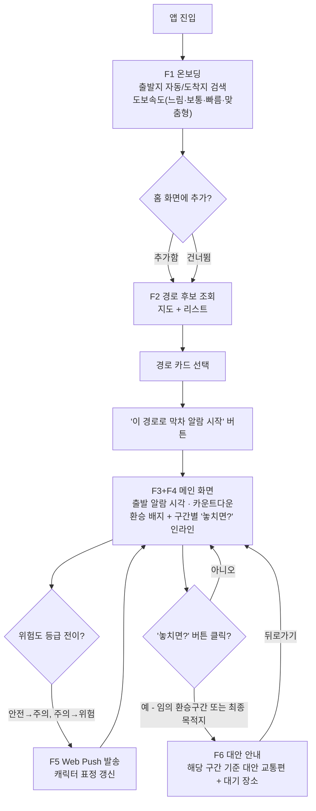
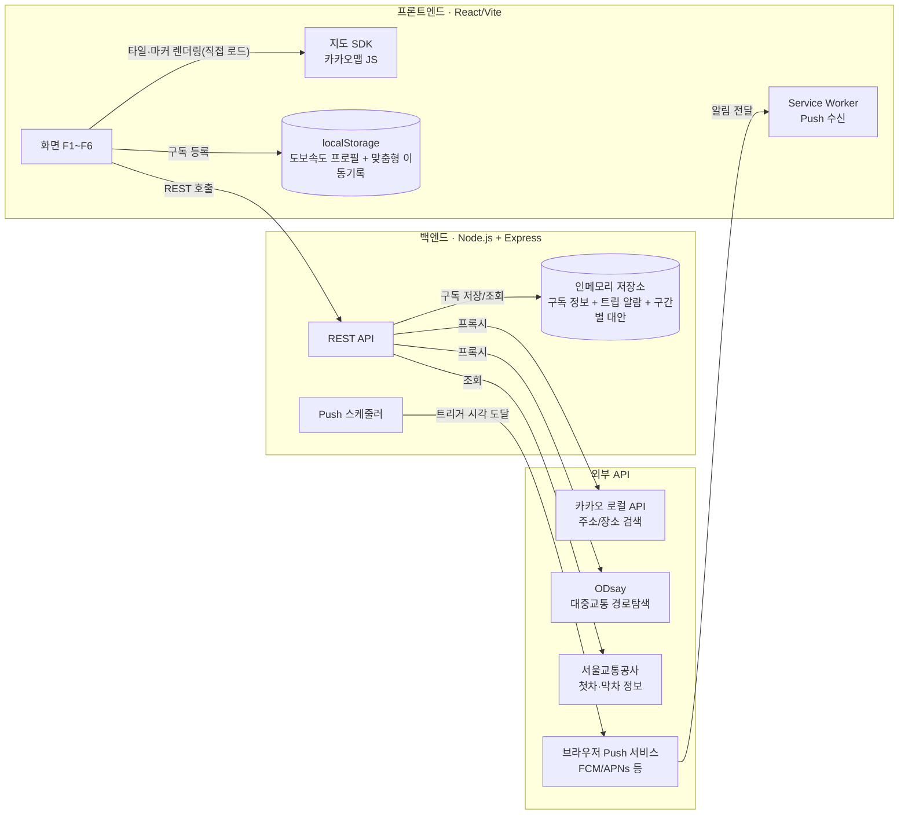

# Newbiton PRD — 환승 막차 알리미 (가칭)

> 작성일: 2026-09-12 (뉴비톤 해커톤 당일) · 상태: 작성 중 (팀 개발 기준 문서)
> 개정 이력: v1(최초 작성) → v2(2026-09-12, 서비스 흐름·화면 구성 기획 변경분 반영 — 도보속도 "맞춤형" 추가, F2 지도 UI 추가, 환승구간별 "놓치면?" 인라인 진입 방식으로 변경 등. 변경 배경과 팀 확정 사항은 각 절 하단의 "v2 변경" 메모 참고)

## 0. 팀 & 기본 정보

| 구분 | 내용 |
|---|---|
| 팀 구성 | 프론트엔드 1명 / 백엔드 1명(본인) / 총괄·보고서(기획+발표자료+진행관리) 1명 |
| 저장소 | GitHub `Newbiton` (프론트엔드는 이 저장소를 클론해 작업) |
| 일정 | 오늘 10:00 시작 → 21:00 개발 완료 → 21:00~22:00 발표자료/데모 준비 → 22:00 종료 |
| 오늘의 성공 기준 | 실제 URL로 배포까지 완료 (심사위원이 직접 접속해 사용 가능한 상태) |

## 1. 개요

### 1.1 문제 정의
대중교통 이용자는 막차 시간을 확인하더라도, 환승이 필요한 경로에서는 환승에 실제로 걸리는 이동 시간을 고려하지 못해 막차를 놓치는 경우가 많다. 또한 기존 막차 안내 서비스는 모든 사용자에게 동일한 소요시간을 적용하기 때문에, 걸음이 느리거나 빠른 사용자에게는 안내 시각이 부정확하다.

### 1.2 해결 방안
서울시 지하철 실시간/막차 데이터와 환승역 소요시간 데이터를 결합하여, 환승을 포함한 경로 기준으로 "지금 출발해야 막차를 탈 수 있는 시각"을 계산해 안내한다. 여기에 사용자의 도보속도 프로필(수동 선택 또는 실제 이동 기록 기반 자동 산출)을 반영해 개인별로 보정된 소요시간을 제공한다.

### 1.3 핵심 가치
- 환승역에서 실제 이동 시간을 반영해 "이론상 막차"가 아닌 "실제로 탈 수 있는 막차"를 안내
- 사용자별 도보속도를 반영한 개인화된 여유시간 계산
- 하나의 화면에서 막차까지 남은 시간을 직관적으로 확인
- 막차를 놓쳤을 때도 당황하지 않도록, 놓치기 전에 이미 구간별 대안을 준비해두고 필요할 때만 확인하게 함

### 1.4 MVP 범위 (v2)
1. **출발지·도착지 설정 및 도보속도 선택** — 도착지는 역·정류장뿐 아니라 임의 주소까지 검색 허용. 도보속도는 느림/보통/빠름/**맞춤형** 4단계 중 선택(기본값 "보통", 최초 1회 선택 후에는 마지막 선택값 유지). **"맞춤형"은 별도의 측정 화면·버튼 없이, 사용자가 실제 경로 안내를 따라 도보 구간을 이동할 때마다 GPS로 소요시간·거리를 기록해 실제 보행속도(m/s)를 자동으로 누적 산출한다**(이동 기록이 충분치 않은 신규 사용자는 "보통" 배율을 기본 적용하며, 기록이 쌓일수록 정확도가 향상됨).
2. **경로 후보 탐색 및 선택** — 지하철·버스를 포함한 경로 후보를 **지도 + 하단 리스트** 형태로 제시하고, 각 후보의 총 소요시간·환승 횟수·도착 예상시각과 그 경로 기준 막차까지 남은 시간을 함께 보여줘 사용자가 비교해 선택. **카드를 고른 뒤 하단의 "이 경로로 막차 알람 시작" 버튼을 눌러야 경로가 확정**된다(기존에는 카드를 탭하면 바로 다음 화면으로 넘어갔음).
3. **선택 경로 기준 역산 출발 알람 시각 제시** — 선택한 경로상 모든 대중교통의 막차/막버스 시각을 고려해 "몇 시까지 출발해야 하는지" 계산.
4. **환승구간별 여유시간 표시** — 안전(5분 이상)/주의(2~5분)/위험(2분 미만) 3등급 색상 배지. **각 환승구간 카드에는 그 구간을 새 출발점으로 하는 대안 안내(F6)로 진입하는 "놓치면?" 버튼이 인라인으로 상시 포함**되며, 평소엔 작게 표시되다가 해당 구간의 통과 예정 시각을 초과하면 카드가 강조된다. **목록의 마지막 항목은 최종 목적지 도착 구간으로, 여기서의 "놓치면?"이 기존의 "막차 최종 실패" 대응 역할을 겸한다.** 환승 상세 경로는 별도 화면 없이 이 화면(메인) 안에 인라인으로 통합해 보여준다.
5. **막차 임박 Web Push 알림 + 캐릭터 표정 변화** — 실제 브라우저 Push 알림(탭이 닫혀 있어도 수신), 위험도 등급 전이에 맞춰 캐릭터 표정이 3~5단계(여유→초조→위험→절박)로 앱 아이콘·알림 이미지에서 점진적으로 변화한다. 한 번의 알림을 새로 발송하는 방식이 아니라 **동일한 알림을 주기적으로 갱신하는 방식으로 구현**해, 잠금화면에 캐릭터 표정과 남은 시간이 상황에 맞춰 계속 바뀌며 떠 있는 것처럼 보이게 한다(표정 이미지는 팀이 직접 제작하며, 프론트엔드 개발 마지막 단계에 적용).
6. **막차 실패(놓치면?) 시 대안 안내** — 강제 전환이나 자동 화면 전환 없이, **사용자가 각 환승구간(또는 최종 목적지) 카드의 "놓치면?" 버튼을 직접 눌렀을 때만 진입**한다. 해당 지점을 새로운 출발점으로 하는 대안 교통수단(심야버스·택시·대기)과 인근 대기 장소를 안내한다(비용 비교는 이번 MVP에서도 계속 제외).

### 1.5 향후 확장 (Future Work, 이번 MVP 범위 제외)
- 알람 실패 시 대안별 비용 비교(택시 요금 추정 등) — **v2 기획 변경 검토 시에도 팀 확정으로 계속 제외**. 대안 카드에는 기존과 동일하게 "비용 비교 예정" 배지만 노출한다.
- 현재 위치 기반 최적 역·정류장 추천 (GPS로 가장 유리한 탑승 지점을 자동 추천)
- 마이페이지/설정 화면(도보속도 수동 재설정, "맞춤형" 누적 이동 기록 확인 등) — 오늘 개발 범위에서는 제외. 시간이 남으면 착수

### 1.6 제약사항 및 가정
- 경로탐색은 [ODsay 대중교통 길찾기 API](https://lab.odsay.com/guide/guide)를 사용해 지하철+버스 통합 경로를 받아오고, 여기에 막차/환승/도보속도 로직을 얹는 방식으로 구현 (자체 경로탐색 알고리즘은 개발하지 않음)
- ODsay는 즉시 자동승인이 아니라 별도 회원가입·앱 등록이 필요 — 오늘 가장 먼저 처리해야 할 항목
- 도착지는 역·정류장명뿐 아니라 임의 주소까지 검색 가능해야 함 — 지오코딩(주소→좌표 변환) API가 별도로 필요하며 5장에서 확정 (ODsay 자체 주소 변환 기능 우선 확인, 부족하면 카카오/네이버 로컬 검색 API 추가 검토)
- **경로 일치 전제 (중요)**: ODsay·네이버지도·카카오맵은 서로 다른 경로탐색 엔진이라, 같은 출발지→도착지라도 환승역·노선 추천이 다를 수 있다. **본 서비스는 사용자가 앱이 계산해 보여준 노선·환승역을 그대로 따라 이동한다는 것을 전제로 막차 역산 알람을 계산한다.** 네이버지도·카카오맵 등 다른 지도 앱은 우리 앱이 지정한 그 역·노선까지 찾아가기 위한 시각적 길안내 용도로만 안내하며(화면에도 이를 명시), 사용자가 임의로 다른 환승역·노선으로 이동을 바꾸면 알람 시각이 실제 상황과 달라질 수 있다는 점을 사용자에게 고지한다 (F3 참고).
- **경로 선택 화면(F2)에 지도 UI가 추가되어 지도 SDK(카카오맵 JavaScript SDK 등) 앱키 발급이 추가로 필요함 — 단계 0에서 ODsay·카카오 로컬 API 키와 함께 확보할 것.** 지도 SDK는 통상 브라우저에서 JavaScript 키로 직접 로드하는 방식이라, "외부 API는 모두 백엔드가 프록시한다"는 4장의 원칙에서 예외로 둔다(지도 타일 자체는 프론트가 SDK로 직접 렌더링, 좌표 검색 등 데이터성 호출만 기존처럼 백엔드 프록시 유지).
- 도보속도는 느림/보통/빠름/맞춤형 4단계 중 선택하며, 선택값과 "맞춤형"의 누적 실측 평균값은 브라우저 localStorage에 저장되어 기기·브라우저별로 독립적으로 관리됨 (다른 기기에서는 프로필이 유지되지 않음)
- **"맞춤형"은 최초 선택 시 측정 기록이 없으므로 "보통"(1.0배) 배율로 시작하고, 실제 도보 구간 이동 기록이 쌓일수록 개인 배율의 정확도가 향상됨.** 해커톤 하루 데모 특성상 누적 기록이 많지 않을 수 있으므로, 기록이 없을 때도 정상 동작(보통 배율 대체)하도록 최소 동작을 보장한다.
- **환승구간별 "놓치면?" 대안 안내가 자동전환이 아닌 사용자 직접 진입 방식으로 바뀌면서, 백엔드는 각 환승구간(및 최종 목적지)마다 대안 정보를 미리 계산해 준비해둬야 함** — 구간 수만큼 대안 조회·계산량이 늘어나는 점을 고려해야 함 (10장 리스크 참고)
- **iOS 제약**: Web Push를 수신하려면 iOS 16.4 이상 + 홈 화면에 추가된 PWA 상태여야 함 (일반 Safari 탭에서는 권한 자체가 뜨지 않음). 따라서 온보딩에 "홈 화면에 추가" 유도 UI가 최소 기능으로 포함되어야 함
- 캐릭터 표정 이미지는 3~5종(팀이 자체 제작해 전달)이며, 프론트엔드는 최종 단계에서 적용

## 2. 핵심 기능 명세

| ID | 기능명 | 우선순위 |
|---|---|---|
| F1 | 출발지·도착지 설정 및 도보속도 선택(느림/보통/빠름/맞춤형) | 필수 (1단계) |
| F2 | 경로 후보 탐색 및 선택 (지도 + 리스트) | 필수 (1단계, F1 직후) |
| F3 | 선택 경로 기준 역산 출발 알람 시각 | 필수 (2단계) |
| F4 | 환승구간별 여유시간 등급 표시 + 구간별 "놓치면?" 인라인 진입 | 필수 (2단계, F3와 함께) |
| F5 | 막차 임박 Web Push + 캐릭터 표정 변화 | 필수 (3단계, 표정 적용은 마지막) |
| F6 | 환승구간/최종 목적지별 막차 실패 대안 안내 | 필수 (4단계) |

### F1. 출발지·도착지 설정 및 도보속도 선택

- **목적**: 경로탐색에 필요한 최소 입력을 받고, 이후 모든 소요시간 계산의 기준이 될 개인 도보속도를 확정한다.
- **입력**
  - 출발지: GPS 기반 현재 위치 자동 수집 (권한 거부 시 텍스트 검색으로 대체)
  - 도착지: 텍스트 검색 — 역·정류장명뿐 아니라 임의 주소·장소명까지 허용, 후보 목록에서 선택
  - 도보속도: **느림/보통/빠름/맞춤형 중 1개 선택** (기본값: 보통)
- **처리 로직**
  - 도착지 검색어를 좌표로 변환 (지오코딩 API, 5장 확정)
  - 느림/보통/빠름은 고정 보정계수로 매핑: **느림 1.2배 · 보통 1.0배 · 빠름 0.8배**(빠를수록 소요시간이 짧아지는 방향. 실제 계수는 개발 중 튜닝)
  - **맞춤형**은 별도 측정 화면 없이, 사용자가 앱 안내를 따라 실제로 도보 구간을 이동할 때마다 GPS 좌표와 소요시간을 기록해 실제 보행속도(m/s)를 계산하고, 누적된 이동 기록의 평균값을 개인 배율로 자동 반영한다. 이동 기록이 충분치 않으면 "보통"(1.0배)을 기본 적용한다.
- **출력/화면**: 온보딩 화면 1개 (위치 권한 요청 → 도착지 검색 → 도보속도 선택 → "홈 화면에 추가" 유도, 한 화면 또는 순차 플로우로 구성)
- **저장**: 도보속도 선택값과 "맞춤형"의 누적 실측 평균값은 브라우저 localStorage에 저장해 다음 방문 시 재사용 (변경 가능, 6.1 데이터 모델 참고)
- **예외 처리**: 위치 권한 거부 시 출발지 텍스트 검색 폴백 제공, 검색 결과 없음 시 안내 메시지. "맞춤형" 선택 시 누적 기록이 아직 없으면 안내 문구와 함께 "보통" 배율로 우선 동작

> **v2 변경**: 기존 "상/중/하 3단계 + 정확히 측정하기(스트레치, 자리만 배치)"에서 "느림/보통/빠름/맞춤형 4단계"로 바뀌었고, "맞춤형"은 버튼을 눌러 진입하는 별도 측정 플로우가 아니라 온보딩에서 선택만 해두면 이후 실제 이동 중 자동으로 데이터가 쌓이는 방식으로 확정. 배율 방향은 기존 로직(빠를수록 배율↓)을 그대로 유지하도록 수정.

### F2. 경로 후보 탐색 및 선택

- **목적**: 하나의 경로만 일방적으로 계산해 보여주지 않고, 여러 이동 방법 중 사용자가 직접 비교해 고를 수 있게 한다.
- **입력**: F1에서 확정된 출발지/도착지 좌표
- **처리 로직**
  1. 백엔드가 ODsay API를 프록시 호출해 출발지→도착지 대중교통 경로 후보 여러 개(지하철/버스 조합별)를 수신
  2. 각 후보에 대해 총 소요시간·환승 횟수·도착 예상시각과, 그 경로 기준 막차·막버스까지 남은 시간을 함께 계산해 목록으로 정렬(예: 막차 여유시간이 넉넉한 순)
- **출력/화면**: 경로 선택 화면 — **지도(선택된 경로의 대략적인 이동 경로 표시) + 하단 카드 리스트**로 구성. 카드에는 "총 소요 OO분 · 환승 O회 · OO:OO 도착 예상 · 막차까지 OO분 남음"을 함께 표시. 카드를 탭하면 해당 경로가 선택(하이라이트)되고, 하단의 **"이 경로로 막차 알람 시작"** 버튼을 눌러야 F3 메인 화면으로 이동
- **사용 데이터/API**: ODsay 대중교통 길찾기 API (다중 경로 옵션 파라미터 확인 필요, 5장 확정), 지도 렌더링용 지도 SDK(카카오맵 JavaScript SDK 등, 1.6 제약사항 참고)
- **예외 처리**: 후보가 1개뿐이거나 없을 경우 안내 문구 처리 (없으면 F6 대안 안내로 유도)

> **v2 변경**: 카드 리스트만 있던 화면에 지도가 추가됨. 카드 표시 항목에 "환승 횟수·도착 예상시각"이 추가되었고, 기존의 "막차까지 남은 시간"은 서비스 핵심 가치와 직결되므로 삭제하지 않고 함께 유지하기로 확정. 선택 방식도 탭 즉시 이동에서 "선택 → 확정 버튼" 2단계로 변경.

### F3. 선택 경로 기준 역산 출발 알람 시각

- **목적**: 사용자가 고른 경로를 기준으로, 막차를 놓치지 않으려면 몇 시까지 출발해야 하는지 계산해 보여준다.
- **입력**: F2에서 선택된 경로, F1의 도보속도 보정계수(느림/보통/빠름 고정값 또는 맞춤형 누적 평균값)
- **처리 로직** (예: 2호선→3호선→5호선 환승 경로 기준)
  1. 선택 경로에 포함된 **대중교통 구간 각각**(예: 2호선, 3호선, 5호선 — 노선별로 전부)의 막차·막버스 시각을 조회한다. **마지막 구간(5호선)의 막차만 보는 것이 아니다.**
  2. 각 구간에 대해 "그 구간의 막차를 타려면 전체 여정을 몇 시에 출발해야 하는가"를 역산한다 — 그 구간의 막차 시각에서 "출발부터 그 구간 탑승 시점까지의 누적 이동시간"(도보 구간은 F1의 보정계수 적용)을 뺀 시각.
  3. 2번에서 구간별로 구한 "허용 가능한 가장 늦은 출발 시각" 중 **가장 이른(가장 빠듯한) 값을 최종 출발 알람 시각으로 채택**한다. 즉 마지막 구간(5호선)의 막차보다, 중간 구간(2호선·3호선)의 막차가 먼저 끊긴다면 그 구간이 병목이 되어 알람 시각이 더 앞당겨진다 — 그래야 경로 전체를 실제로 완주할 수 있는 마지노선이 된다.
  4. 현재 시각과 비교해 카운트다운 형태로 표시
- **출력/화면**: 메인 화면 — 출발 알람 시각(예: "18:47까지 출발하세요"), 남은 시간 카운트다운, 경로 요약(환승 횟수·전체 소요시간), 시그니처 캐릭터와 표정. **경로 요약에는 노선명·환승역명을 작은 배지가 아니라 눈에 띄게 표시**하고, "이 노선·환승역 기준으로 계산된 알람이에요. 다른 경로로 이동하면 시간이 달라질 수 있어요" 같은 안내 문구를 노출한다 — 사용자가 필요하면 그 역·노선명을 그대로 네이버지도·카카오맵 등에 검색해 시각적 길안내만 별도로 받을 수 있게 하되, 우리 알람은 화면에 표시된 경로를 그대로 따른다는 전제로 동작함을 명확히 한다 (1.6 "경로 일치 전제" 참고)
- **사용 데이터/API**: 서울교통공사 첫차·막차 정보, 서울시 막차시간표 검색, (버스) 국토교통부/서울시 버스 관련 막차 데이터 — 5장에서 확정
- **예외 처리**: 경로상 막차가 이미 종료된 노선이 있을 경우 F6(대안 안내)로 유도, ODsay 응답 실패 시 재시도 또는 에러 안내

> **v2 변경**: 사용자가 우리 앱과 별개로 네이버지도·카카오맵 등 다른 지도 앱의 길안내를 따라 이동할 수 있다는 점이 논의되면서, "우리가 계산한 특정 노선·환승역을 그대로 따른다"는 전제를 명시적으로 화면에 드러내기로 확정. ODsay·네이버지도·카카오맵은 서로 다른 경로탐색 엔진이라 추천 경로가 다를 수 있으므로, 다른 지도 앱은 어디까지나 우리가 지정한 역·노선까지 가기 위한 시각적 길안내 보조 수단으로만 안내한다(경로 재탐색·대체 용도 아님).

### F4. 환승구간별 여유시간 등급 표시 + 구간별 "놓치면?" 인라인 진입

- **목적**: 환승이 여러 번 있는 경로에서 어느 구간이 가장 빠듯한지 한눈에 보여주고, 각 구간에서 막차를 놓쳤을 때의 대안을 미리 준비해 필요할 때 바로 확인할 수 있게 한다.
- **입력**: F3에서 계산된 각 환승 구간별 여유시간(다음 열차/버스 출발까지 남는 시간 − 환승 이동 소요시간)
- **처리 로직**
  1. 구간별 여유시간을 5분 이상(안전) / 2~5분(주의) / 2분 미만(위험) 3등급으로 분류
  2. **각 구간(환승 구간 + 최종 목적지 도착 구간)마다 대안 정보(F6)를 미리 계산해 백엔드가 준비**해둔다
- **출력/화면**: F3 메인 화면 내 경로 요약에 환승 구간마다 색상 배지(초록/노랑/빨강)로 표시. **각 구간 카드에는 "놓치면?" 버튼이 인라인으로 상시 포함**되며 평소엔 작게 표시되다가, 해당 구간의 통과 예정 시각을 초과하면 카드 전체가 강조(색상/크기 변화)된다. **리스트의 마지막 항목은 최종 목적지 도착 구간**이며, 여기서의 "놓치면?"이 기존 "막차 최종 실패" 대응 역할을 겸한다. 환승 상세 경로(해당 구간의 세부 이동 정보)는 별도 화면 없이 이 화면 안에서 카드를 펼치면 인라인으로 보여준다.
- **예외 처리**: 환승이 없는 단일 노선 경로는 중간 환승 배지 표시를 생략하고, 최종 목적지 구간의 "놓치면?"만 노출

> **v2 변경**: 기존에는 "알람 시각을 초과하면 자동으로 F6 화면으로 전환"되는 구조였으나, 이번 개정으로 **자동 전환을 없애고 사용자가 직접 "놓치면?" 버튼을 눌러야 F6로 진입**하는 방식으로 확정. 대신 환승 구간마다(뿐 아니라 최종 목적지까지) 개별 대안을 미리 준비해두는 방식으로 F6의 진입 지점이 여러 곳으로 늘어남. 환승 상세는 별도 화면을 만들지 않고 이 화면에 인라인으로 통합하기로 확정.

### F5. 막차 임박 Web Push 알림 + 캐릭터 표정 변화

- **목적**: 사용자가 앱을 보고 있지 않아도 막차 임박 상황을 놓치지 않도록 알리고, 감정적으로 몰입되는 캐릭터 연출로 긴박함을 전달한다.
- **입력**: F4의 위험도 등급 전이 시점 (안전→주의, 주의→위험)
- **처리 로직**
  - 프론트엔드에서 Push 구독을 생성해 백엔드에 저장
  - 백엔드가 F3에서 계산된 시각을 기준으로 위험도 등급이 바뀌는 시점마다 Web Push 메시지 발송 (VAPID 기반, web-push 라이브러리 사용)
  - 알림에 포함되는 이미지/앱 아이콘을 위험도 등급에 맞는 캐릭터 표정(3~5단계: 여유→초조→위험→절박)으로 전환
  - **강제로 새 알림을 계속 띄우는 대신, 동일한 알림을 주기적으로 갱신하는 방식으로 구현**하여 잠금화면에 캐릭터 표정과 남은 시간이 상황에 맞춰 계속 바뀌며 떠 있는 것처럼 보이게 한다
- **출력/화면**: OS 알림 센터에 표시되는 Push 알림, 알림 클릭 시 앱으로 복귀
- **의존성/제약**: iOS는 16.4 이상 + 홈 화면 추가 PWA 상태에서만 수신 가능 (F1 온보딩에서 "홈 화면에 추가" 유도를 바로 노출). 캐릭터 표정 이미지 3~5종은 팀이 직접 제작해 프론트엔드에 전달
- **개발 순서**: 백엔드 Push 발송 로직과 기본 알림(텍스트)은 초기 단계에 구현하고, 캐릭터 표정 이미지 적용은 프론트엔드 개발 마지막 단계에서 진행
- **예외 처리**: Push 권한 거부 시 앱 내 배너로 대체 안내

> **v2 변경**: 캐릭터 표정 단계를 기존 3단계(안전/주의/위험)에서 3~5단계(여유→초조→위험→절박)로 세분화할 수 있도록 범위를 넓힘. 위험도 색상 등급(F4, 3단계) 자체는 그대로 유지하고, 표정 이미지 개수만 팀 제작 여건에 따라 유연하게 가져가기로 확정. "알림을 지속적으로 갱신"하는 구현 방식은 기존 계획과 동일하며, 이번에 문구로 명확히 보강.

### F6. 환승구간/최종 목적지별 막차 실패 대안 안내

- **목적**: 사용자가 특정 구간(환승 지점 또는 최종 목적지)에서 더 이상 원래 경로대로 막차를 탈 수 없다고 판단해 직접 확인을 요청했을 때, 당황하지 않도록 그 지점 기준 대안을 즉시 제시한다.
- **입력**: F4의 특정 구간 카드에서 사용자가 누른 "놓치면?" 버튼 (어느 구간에서 눌렀는지 식별 정보 포함)
- **처리 로직**: 눌린 구간의 위치를 새로운 출발점으로 하여, 이용 가능한 대안 교통수단(심야버스, 택시 승차 지점, 대기 후 첫차 등) 후보를 조회하고, 근처 대기 장소(편의점, 24시간 시설 등) 정보를 함께 제시. 이 계산은 사용자가 버튼을 누르는 시점이 아니라 **F4 단계에서 구간별로 미리 준비**해두는 것을 원칙으로 한다.
- **출력/화면**: 대안 안내 화면 — 심야버스 / 택시 / 대기(첫차까지) 3열 비교 카드(각각 소요시간 표시, 비용 비교 수치는 이번 범위에서 제외하고 "비용 비교 예정" 문구만 노출) + 근처 대기 장소 리스트. **강제 전환이나 별도 확인 절차 없이 열람 후 뒤로가기를 누르면 언제든 F3+F4 메인 화면으로 복귀**한다.
- **사용 데이터/API**: 5장에서 확정 (심야버스 노선 데이터, 대기 장소용 POI 데이터 등 추가 조사 필요)
- **예외 처리**: 대안 교통수단도 없는 완전 심야 시간대(예: 새벽 2~4시)에는 "다음 첫차 시각" 안내로 대체 — 이번 개정으로 "대기(첫차까지)"가 예외 처리가 아니라 3열 비교 카드의 정식 옵션 중 하나로 승격됨

> **v2 변경**: 진입 지점이 "알람 시각 초과 시 자동 전환되는 단일 종점"에서 "환승구간마다 사용자가 직접 여는 여러 진입점"으로 늘어남. 비용 비교는 팀 논의 결과 **이번에도 MVP 범위에서 제외를 유지**하기로 확정(택시 요금·심야버스 요금 데이터 확보와 계산 로직에 시간이 더 필요하다고 판단). "대기"는 예외 케이스에서 정식 비교 옵션으로 격상.

## 3. 사용자 플로우



1. 사용자가 앱을 열면 F1 온보딩에서 출발지(자동)·도착지(검색)·도보속도(느림/보통/빠름/맞춤형)를 설정하고, iOS라면 "홈 화면에 추가" 배너를 본다.
2. F2에서 지도와 함께 경로 후보를 비교하고 카드를 선택한 뒤, "이 경로로 막차 알람 시작" 버튼으로 경로를 확정한다.
3. F3+F4 메인 화면으로 이동해 출발 알람 시각, 카운트다운, 환승구간 여유시간 배지(각 구간에 "놓치면?" 버튼 포함)를 확인한다.
4. 앱을 보고 있지 않아도 위험도 등급이 바뀔 때마다 F5 Push 알림과 캐릭터 표정 변화로 안내받는다.
5. 특정 환승구간 또는 최종 목적지에서 막차를 놓칠 것 같다고 판단되면, 사용자가 해당 구간의 "놓치면?" 버튼을 직접 눌러 F6 대안 안내를 확인하고, 뒤로가기로 언제든 메인 화면으로 돌아간다.

## 4. 시스템 아키텍처



- **원칙**: 검색·경로탐색 등 데이터성 외부 호출은 백엔드가 프록시한다. 서비스키는 백엔드 환경변수로만 보관하고 프론트엔드에는 절대 노출하지 않는다. **단, 지도 SDK(카카오맵 JavaScript SDK 등)는 통상 브라우저에서 자체 JavaScript 키로 직접 로드하는 방식이라 이 원칙의 예외로 둔다** — 지도 렌더링 자체는 프론트가 SDK로 직접 처리하고, 좌표 검색·경로탐색 같은 데이터 호출은 기존처럼 백엔드 프록시를 그대로 사용한다.
- **프론트엔드(React/Vite)**: 화면 렌더링, 지도 SDK를 이용한 F2 지도 표시, 도보속도 프로필(및 "맞춤형" 누적 이동기록)의 localStorage 관리, Service Worker 등록 및 Push 구독 생성.
- **백엔드(Node.js/Express)**: REST API 제공, 외부 API 프록시·가공(경로 후보에 막차 정보 결합, 역산 알람 시각 계산, 위험도 등급 산출), **환승구간·최종 목적지별 대안 정보 사전 계산**, Push 구독 저장, 등급 전이 시점마다 Push 발송을 트리거하는 스케줄러(setInterval 또는 경량 작업 큐로 구현).
- **저장소**: 앱 전용 DB는 두지 않는다. Push 구독 및 진행 중인 트립의 알람 상태·구간별 대안 정보는 백엔드 프로세스의 인메모리 저장소(Map/객체)에 보관한다. 서버가 재시작되면 진행 중인 구독 정보가 초기화되는 점을 감수하고, 오늘 하루 데모 목적에 한해 허용한다(10장 리스크에 명시).

## 5. API 명세

> 베이스 URL은 배포 시 확정. 아래는 프론트엔드가 바로 개발을 시작할 수 있도록 정한 계약(contract)이며, 백엔드 구현 중 세부 필드명은 조정될 수 있다(변경 시 이 표를 갱신).

| 메서드 | 엔드포인트 | 설명 | 대응 기능 |
|---|---|---|---|
| GET | `/api/geocode?query=` | 검색어(역명/장소/주소)를 좌표 후보 목록으로 변환. 카카오 로컬 API 프록시 | F1 |
| GET | `/api/routes?startX=&startY=&endX=&endY=&walkSpeed=&personalFactor=` | 경로 후보 목록 반환 (아래 스키마) | F2, F3, F4 |
| POST | `/api/push/subscribe` | Push 구독 정보 + 선택된 트립의 알람 정보 저장 | F5 |
| DELETE | `/api/push/subscribe/:id` | 트립 종료/알람 취소 시 구독 해제 | F5 |
| GET | `/api/alternatives?lat=&lng=&time=&segmentId=` | 특정 구간(환승 지점 또는 최종 목적지) 기준 대안 교통수단 + 대기 장소 목록 | F6 |

> **v2 변경**: `walkSpeed` 파라미터 값이 `상|중|하` → `느림|보통|빠름|맞춤형`으로 바뀐다. `맞춤형` 선택 시 프론트엔드가 localStorage에 누적된 실측 평균으로 계산한 개인 배율을 `personalFactor`(예: `0.93`)로 함께 전달하고, 값이 없으면 백엔드는 "보통"(1.0배)을 기본 적용한다. `/api/alternatives`에는 어느 구간에서 진입했는지 구분하기 위한 `segmentId`(선택, 예: 환승 구간 인덱스 또는 `"final"`)가 추가된다.

### `GET /api/routes` 응답 스키마 (예시)
```json
{
  "candidates": [
    {
      "routeId": "r1",
      "legs": [
        { "mode": "subway", "line": "2호선", "from": "강남", "to": "잠실", "durationMin": 12 },
        { "mode": "transfer", "durationMin": 4, "walkAdjustedMin": 4.8 },
        { "mode": "bus", "line": "지선버스 461", "from": "잠실역", "to": "목적지 인근", "durationMin": 15 }
      ],
      "totalDurationMin": 34,
      "transferCount": 1,
      "arrivalEstimate": "2026-09-12T19:05:00+09:00",
      "transferGaps": [
        {
          "segmentId": "t1",
          "afterLeg": 0,
          "minutesLeft": 6,
          "safety": "safe",
          "location": { "x": 127.1, "y": 37.51 }
        },
        {
          "segmentId": "final",
          "afterLeg": 2,
          "minutesLeft": null,
          "safety": null,
          "location": { "x": 127.12, "y": 37.5 }
        }
      ],
      "departureDeadline": "2026-09-12T18:47:00+09:00",
      "minutesUntilDeadline": 23
    }
  ]
}
```
- `walkAdjustedMin`은 F1의 도보속도 보정계수(고정값 또는 `personalFactor`)를 적용한 값.
- `transferGaps[].safety`는 F4 기준(5분↑ safe / 2~5분 caution / 2분미만 danger)으로 백엔드가 계산해 내려준다 — 프론트는 색상만 매핑. **마지막 항목(`segmentId: "final"`)은 최종 목적지 도착 구간**으로, `minutesLeft`/`safety`는 사용하지 않고(`null`) `location`만 F6 진입 시 사용한다.
- `transferGaps[].location`은 해당 구간의 좌표로, F4 화면에서 "놓치면?" 버튼을 눌렀을 때 `/api/alternatives`에 그대로 전달한다.
- 후보가 여러 개면 `candidates` 배열에 여러 항목이 담기며, F2 화면은 지도에 대략적인 경로를, 하단에는 이 배열을 카드 리스트로 렌더링한다.

### `POST /api/push/subscribe` 요청 예시
```json
{
  "subscription": { "endpoint": "...", "keys": { "p256dh": "...", "auth": "..." } },
  "selectedRoute": { "departureDeadline": "2026-09-12T18:47:00+09:00", "transferGaps": [ ... ] }
}
```

### `GET /api/alternatives` 응답 스키마 (예시)
```json
{
  "segmentId": "t1",
  "transitAlternatives": [
    { "type": "night_bus", "name": "심야버스 N26", "walkMin": 4, "intervalMin": 20 },
    { "type": "taxi", "name": "택시 승차 지점", "walkMin": 2 },
    { "type": "wait_first_train", "name": "첫차까지 대기", "firstTrainTime": "2026-09-13T05:30:00+09:00" }
  ],
  "waitingSpots": [
    { "name": "24시간 편의점", "walkMin": 1 }
  ],
  "costComparison": null
}
```
- `costComparison`은 Future Work 자리로 항상 `null` 반환 (프론트는 이 필드가 null이면 "비용 비교 예정" 배지를 표시) — **v2에서도 계속 제외 확정**.
- `transitAlternatives`에 `type: "wait_first_train"`이 추가되어, 심야버스·택시와 함께 "대기(첫차까지)"도 3열 비교 카드의 정식 옵션으로 표시된다.

## 6. 데이터 모델

### 6.1 프론트엔드 — localStorage
```json
{
  "walkSpeedLevel": "보통",
  "walkSpeedMeasuredSecPer100m": null,
  "homeScreenPromptDismissed": false
}
```
- `walkSpeedLevel`은 `"느림" | "보통" | "빠름" | "맞춤형"` 중 하나.
- `walkSpeedMeasuredSecPer100m`은 "맞춤형" 선택 후 실제 도보 구간 이동 기록이 쌓이면서 갱신되는 누적 평균값(100m당 소요 초). 기록이 없으면 `null`이며, 이 경우 "보통" 배율로 동작한다.

### 6.2 백엔드 — 인메모리 (프로세스 재시작 시 초기화됨)
```
PushSubscription {
  id: string
  endpoint, keys
  departureDeadline: datetime
  transferGaps: [...]
  lastNotifiedSafety: "safe" | "caution" | "danger" | null
}
```
백엔드 스케줄러는 주기적으로(예: 10초 간격) 저장된 트립들을 순회하며 현재 시각 기준 위험도 등급을 재계산하고, `lastNotifiedSafety`와 달라졌을 때만 Push를 발송한다. **환승구간이 여러 개인 경로에서는 가장 임박한(또는 현재 진행 중인) 구간을 기준으로 등급을 판단하는 것을 기본으로 하며, 세부 판단 기준은 백엔드 구현 단계에서 확정한다.**

## 7. 개발 프로세스

원칙: **한 단계가 끝날 때마다 반드시 테스트·검증하고, 결과를 요약 보고한 뒤 "다음 단계 진행" 지시가 있어야 다음 단계로 넘어간다.**

| 단계 | 내용 | 담당 | 완료 기준(테스트) |
|---|---|---|---|
| 0 | 저장소/환경 세팅 — 백엔드 Express 스캐폴드, 프론트 Vite 스캐폴드, ODsay·공공데이터포털·카카오 로컬 API·**지도 SDK** 키 발급 | 백엔드+프론트 | 양쪽 로컬 서버 정상 기동, 키 발급 완료 확인 |
| 1 | F1 온보딩 — 프론트 UI(느림/보통/빠름/맞춤형) + `/api/geocode` 연동 | 프론트/백엔드 | 임의 주소 검색 시 좌표 정상 반환, 도보속도 선택값 localStorage 저장 확인 |
| 2 | F2 경로 후보 — `/api/routes` 구현(ODsay 프록시+막차 결합) + 프론트 지도·리스트 화면 | 백엔드 우선, 프론트 병행 | 실제 구간으로 호출해 후보 2개 이상, 막차 남은시간 값이 합리적인지 확인, 지도에 경로 표시 확인 |
| 3 | F3+F4 메인 화면 — 역산 알람 시각, 카운트다운, 환승 배지 + 구간별 "놓치면?" 인라인(환승 상세 통합 포함) | 프론트 | 시각이 실제 시계와 맞게 카운트다운되는지, 배지 색상이 임계값대로 바뀌는지, "놓치면?" 버튼이 각 구간에 노출되는지 확인 |
| 4 | F5 Push — 백엔드 스케줄러 + 프론트 Service Worker/구독 (텍스트 알림까지, 캐릭터 이미지 제외) | 백엔드+프론트 | 실기기(안드로이드/아이폰 PWA)에서 등급 전이 시 알림 실제 수신 확인 |
| 5 | F6 대안 안내 — 구간별 진입(자동전환 없음) | 백엔드+프론트 | 특정 환승구간의 "놓치면?" 버튼을 눌러 그 구간 기준 대안 화면 전환 확인, 뒤로가기로 메인 복귀 확인 |
| 6 | 폴리싱 — 캐릭터 표정 이미지 F5에 적용(프론트 마지막), "맞춤형" 실측 누적 로직 마무리, 전체 화면 스타일 다듬기 | 프론트 | 표정이 실제 알림/아이콘에 반영되는지, 맞춤형 배율이 이동 기록에 따라 갱신되는지 확인 |
| 7 | 배포 | 백엔드+프론트 | 배포된 URL에서 전체 플로우(F1→F6) 재현 확인 |

## 8. 일정

| 시간 | 단계 |
|---|---|
| 10:00 – 10:30 | 단계 0: 환경 세팅, API 키 발급(지도 SDK 키 포함) |
| 10:30 – 12:00 | 단계 1: F1 온보딩 |
| 12:00 – 14:00 | 단계 2: F2 경로 후보 (지도 포함) |
| 14:00 – 16:00 | 단계 3: F3+F4 메인 화면 |
| 16:00 – 18:30 | 단계 4: F5 Push (텍스트 알림까지) |
| 18:30 – 19:30 | 단계 5: F6 대안 안내 (구간별 진입) |
| 19:30 – 20:30 | 단계 6: 폴리싱(캐릭터 표정 적용, 맞춤형 마무리 등) |
| 20:30 – 21:00 | 단계 7: 배포 및 전체 플로우 리허설 |
| 21:00 – 22:00 | 발표자료/데모 준비 (총괄 담당) |

각 시간대는 목표치이며, 매 단계 종료 시 실제 소요와 이슈를 다음 단계 시작 전에 팀에 공유한다. **이번 개정으로 지도 UI·맞춤형 실측·구간별 대안 계산이 추가되어 기존 계획보다 범위가 늘었으므로, 일정이 지연될 경우 10장의 축소 우선순위를 따른다.**

## 9. 배포 계획

- **프론트엔드**: Vercel — React/Vite 프로젝트를 GitHub 저장소와 연결해 자동 배포
- **백엔드**: Render — Node/Express 서버 배포 (무료 플랜, 슬립 모드 유의 — 데모 직전 미리 한 번 호출해 깨워둘 것)
- **환경변수**: ODsay 앱키, 공공데이터포털 서비스키, 카카오 로컬 API 키, **지도 SDK(카카오맵 JavaScript) 앱키**, VAPID 키(Push)는 모두 백엔드 배포 환경변수로 등록. 프론트엔드에는 백엔드 API 베이스 URL과 지도 SDK JavaScript 키만 환경변수로 전달
- **CORS**: 백엔드는 배포된 프론트엔드 도메인만 허용하도록 설정

## 10. 제약사항 및 리스크

- 경로탐색은 ODsay API에 의존 — 오늘 회원가입·앱 등록이 지연되면 F2 전체가 막히므로 단계 0에서 최우선 처리
- **막차 알람의 정확도는 "사용자가 앱이 계산한 경로(같은 노선·같은 환승역)를 그대로 따른다"는 전제에 의존함.** ODsay·네이버지도·카카오맵은 서로 다른 경로탐색 엔진이라 추천 경로가 다를 수 있어, 사용자가 실제로는 다른 지도 앱의 추천을 따라 다른 환승역·노선으로 이동하면 알람 시각이 실제 상황과 어긋날 수 있음 — F3 화면에 노선·환승역을 크게 표시하고 안내 문구를 넣어 리스크를 완화하되, 완전히 제거되지는 않는 한계로 인지하고 데모 시나리오도 이 전제(안내된 경로 그대로 이동)에 맞춰 준비할 것
- 인메모리 저장소를 사용하므로 백엔드 서버가 재배포/재시작되면 진행 중인 Push 구독이 모두 초기화됨 — 데모 직전에는 서버 재시작을 피할 것
- iOS Push는 16.4 이상 + 홈 화면 추가 PWA 상태에서만 동작 — 데모 리허설 시 반드시 실제 아이폰으로 "홈 화면에 추가" 후 테스트할 것 (시뮬레이터/일반 사파리 탭에서는 재현되지 않음)
- 무료 API(ODsay Basic, 카카오 로컬, 공공데이터포털, 지도 SDK)의 일일 호출 한도를 사전에 확인하지 못함 — 개발 중 호출 수를 아껴 쓰고, 한도 초과 에러 처리(재시도/캐시)를 최소한으로 넣을 것
- 도보속도 프로필은 브라우저 localStorage 기반이라 기기·브라우저별로 독립적 — 다른 기기에서는 재설정 필요
- **"맞춤형" 실측은 실제 이동 기록이 쌓여야 정확도가 올라가므로, 데모 당일 짧은 시간 안에는 기록이 거의 없을 수 있음 — 기록이 없을 때 "보통" 배율로 자연스럽게 동작하는 최소 기능을 반드시 먼저 보장하고, 실측 누적 로직은 그 위에 추가한다.**
- **환승구간별 "놓치면?" 대안을 미리 계산해두는 구조라, 구간 수가 많은 경로일수록 백엔드의 사전 계산 부하가 커짐 — 데모용 경로 기준으로는 문제되지 않을 것으로 보이나, 개발 중 확인 필요**
- 캐릭터 표정 이미지 3~5종은 팀이 별도 제작 — 완성이 늦어지면 텍스트 알림만으로도 F5는 기능적으로 완결되도록 개발 순서를 잡음(7장 참고)
- 대안 안내(F6)에 필요한 심야버스 노선·대기 장소 데이터 소스는 아직 미확정 — 단계 5 착수 전 조사 필요
- 비용 비교(F6 확장) 및 현재위치 기반 최적역 추천, 마이페이지/설정 화면은 이번 MVP에서 의도적으로 제외 (1.5 향후 확장 참고)
- **오늘 일정이 빠듯할 경우 축소 우선순위**: ① "맞춤형" 실측 로직을 뒤로 미루고 "보통" 고정 배율로 대체 → ② F2 지도를 빼고 카드 리스트만 유지 → ③ 환승구간별 개별 대안 계산을 최종 목적지 구간 하나로 축소(기존 v1 방식으로 되돌림). 이 순서대로 기능을 덜어내며, F1~F5의 핵심 알람 로직은 끝까지 유지한다.
